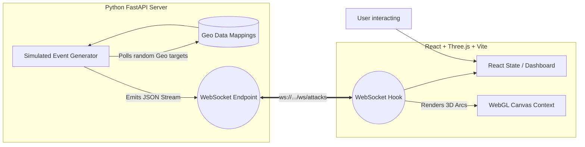

# DDoS Intelligence System — Global Threat Map


A full-stack, real-time DDoS attack map simulator built for academic and analytical visualization. 
Displays synthetic cross-origin cyber threat streams on an interactive 3D globe with live metrics, severity scoring, and robust mitigation dashboard panels.

**IMPORTANT: This is strictly a simulation.** All attack data is procedurally generated locally using statistical distribution models based on real-world probability mappings. No live attack intelligence is used.

## 🚀 Key Features
- **3D Interactive Globe:** Procedurally generated Earth with `OrbitControls` and atmospheric shading.
- **WebSocket Streaming Engine:** Continuously synthesizes Volumetric, Protocol, and App-Layer attacks with burst probabilities.
- **Attack Arc Visualization:** Curved `QuadraticBezier` trajectories glowing based on Low / Moderate / High / Critical severities.
- **Real-time Metrics Dashboards:** Live feed showing Peak Throughput (Gbps), Packet Rate (Mpps), blocked vs clean traffic, and HTTP request layers.

---

## 📐 System Architecture & Data Flow

The system follows a modernized streaming architecture capable of pushing thousands of real-time events over bidirectional WebSockets directly into the WebGL renderer context without blocking the React main thread.



---

## 🗄️ Entity Schema (Simulated Database)

Although the system currently operates statelessly using in-memory generation, the Data Model streamed to the clients matches this JSON/Document schema design (e.g. for MongoDB Atlas insertion).

| Field | Type | Description |
|---|---|---|
| `attack_id` | `UUID` | Unique identifier for the threat event |
| `timestamp` | `Float` | Epoch timestamp of event generation |
| `attack_type` | `String` | Specific protocol vector (e.g. `SYN_FLOOD`, `DNS_AMPLIFICATION`) |
| `attack_layer` | `String` | OSI Model layer (`L3`, `L4`, `L7`) |
| `source_country_code` | `String` | 2-letter ISO origin country abbreviation |
| `destination_country_code`| `String` | targeted victim country code |
| `throughput_gbps` | `Float` | Generated network volume in Gigabits per second |
| `requests_per_second` | `Float` | Generated volume for L7 app-layer attacks |
| `severity_level` | `Enum` | `LOW`, `MODERATE`, `HIGH`, `CRITICAL` based on metric norms |
| `mitigation.clean_traffic`| `Float`| Expected throughput successfully let through |

---

## 💻 Installation & Running Locally

### Prerequisites
- Node.js `v18+`
- Python `3.10+`

### 1. Start the Backend API (Terminal 1)
```bash
cd backend

# Create a virtual environment and install dependencies
python -m venv venv
# Windows:
venv\Scripts\activate
# Mac/Linux:
# source venv/bin/activate

pip install -r requirements.txt

# Start the FastAPI server on port 8000
python -m uvicorn api.server:app --port 8000
```
*The backend generates attack events and streams them via WS to `ws://localhost:8000/ws/attacks`.*

### 2. Start the Frontend App (Terminal 2)
```bash
cd frontend

# Install Node dependencies
npm install

# Start the Vite development server
npm run dev
```

### 3. Open Visualization
Open **[http://localhost:5173](http://localhost:5173)** in your browser.

---

## 🛠️ Built With

* **Frontend:** React, Vite, Three.js (`@react-three/fiber`), `d3-geo`, Recharts
* **Backend:** Python, FastAPI, WebSockets (`uvicorn`, `pydantic`)
* **Styling:** Custom Vanilla CSS with Cyberpunk/Glassmorphism theme variables.
